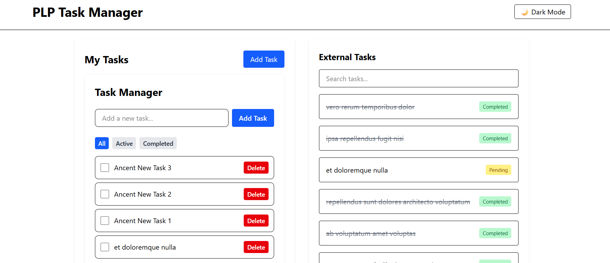

# 📝 PLP Task Manager

A responsive task management web application built with **React.js**, **JSX**, and **Tailwind CSS**. This app allows users to manage their tasks and view external tasks fetched from a public API.

---

## 🚀 Features

- Add, complete, and delete tasks
- Filter tasks by status (All, Active, Completed)
- Persist tasks with **localStorage**
- Fetch and display external tasks from [JSONPlaceholder](https://jsonplaceholder.typicode.com/)
- Search and paginate through API tasks
- Toggle between light and dark themes using **React Context API**
- Responsive UI using **Tailwind CSS**

---

## 📁 Project Structure

```
src/
├── components/
│   ├── ApiData.jsx
│   ├── Button.jsx
│   ├── Layout.jsx
│   ├── TaskManager.jsx
│   ├── TaskModal.jsx
│   └── ThemeContext.jsx
├── App.jsx
├── index.css
└── main.jsx
```

---

## 🛠️ Setup Instructions

1. **Clone the Repository**

```bash
git clone https://github.com/PLP-MERN-Stack-Development/week-3-react-js-assignment-Ancentian.git
cd plp-task-manager
```

2. **Install Dependencies**

```bash
npm install
```

3. **Run the Development Server**

```bash
npm run dev
```

4. **Build for Production**

```bash
npm run build
```

---

## 🌐 Live Demo

Deployed URL: [https://week3-plp-task-manager.vercel.app/]

---

## 🧪 Technologies Used

- React.js
- Tailwind CSS
- React Router DOM
- Vite
- Local Storage
- JSONPlaceholder API

---

## 📸 Screenshots

Screenshots showcasing the task manager, dark mode, and API tasks view.


---

## 📄 License

MIT License  
© 2025 Ancent PLP Task Manager

